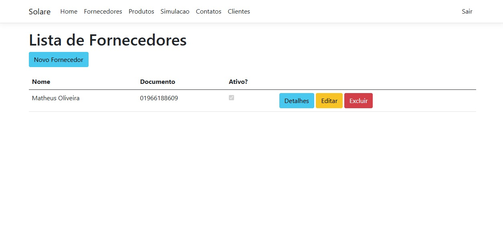

## 6. Interface do Sistema

_Visão geral da interação do usuário por meio das telas do sistema. Estas são as principais interfaces do sistema._

### 6.1. Tela Principal do Sistema  

### 6.2. Telas do Processo 1  
  
.jpg)  
.jpg)

### 6.3. Telas do Processo 2  
  
.jpg)

### 6.4. Telas do Processo 3  
  
.jpg)

### 6.5. Telas do Processo 4  

.png)
