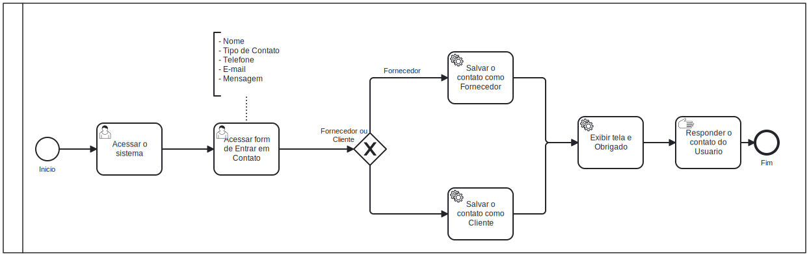

# 3.3.1 Processo 1 – Entrar em Contato

Este processo descreve as etapas que um cliente interessado nos serviços oferecidos pela **Solar-E** deve seguir. É necessário entrar em contato com a empresa para que seu cadastro seja realizado corretamente.

---

## Oportunidades de Melhoria

- Automatizar o processo de verificação de duplicidade de e-mails no sistema, reduzindo a necessidade de intervenção manual.  
- Melhorar a interface do formulário para torná-lo mais intuitivo, especialmente ao distinguir entre tipos de usuários (Fornecedor/Cliente).  
- Implementar um chatbot inicial para coletar informações básicas e agilizar o contato com agentes.  

---

## Detalhamento das Atividades

1. **Acessar o Sistema**  
   - O cliente inicia o acesso ao sistema através do portal principal.

2. **Acessar Formulário de Cadastro**  
   - O cliente é direcionado para a tela de formulário onde deve informar se seu interesse é ser:  
     - **Fornecedor:** preencher as informações básicas de contato.  
     - **Cliente (interessado no sistema fotovoltaico):** preencher dados adicionais sobre o projeto.

   ### Informações Básicas (para todos os cadastros):  
   - Nome  
   - E-mail  
   - Telefone  
   - Mensagem (opcional)

3. **Tela de Agradecimento**  
   - O sistema mostra uma tela de agradecimento ao cliente.

4. **Atendimento**  
   - Um agente **Solar-E** dá continuidade ao processo entrando em contato com os interessados e coletando os dados necessários para as etapas seguintes:    

   ### Informações Adicionais (interessados em serem fornecedores):  
   - Lista de produtos.  

   ### Informações Adicionais (interessados no sistema fotovoltaico):  
   - Nome do projeto.  
   - CEP.  
   - Número de águas do telhado.  
   - Metragem em metros quadrados de cada água.  
   - Dados de consumo mensal (média dos últimos 12 meses).  
   - Valores pagos (média dos últimos 12 meses).  
   - Especificações dos módulos solares (área e potência).  
   - Tipo de telhado.  
   - Intenção de upgrade na geração.  
   - Percentual de crescimento da usina (30%, 50%, 100%).  

5. **Fim**  
   - O processo é concluído ao encerrar as operações ou visualizar o resumo de ações realizadas.

---

## Tipos de Dados Utilizados

| **Campo**           | **Tipo**         | **Restrições**                          | **Valor Default**             |  
|---------------------|------------------|-----------------------------------------|-------------------------------|  
| Nome                | Caixa de texto   | Mínimo de 5 caracteres                  | -                             |  
| E-mail              | Caixa de texto   | Formato válido (e.g., nome@dominio.com) | -                             |  
| Telefone            | Caixa de texto   | Obrigatório, formato (DDD) 9XXXX-XXXX   | -                             |  
| Interesse           | Enum             | Restrições: "Fornecedor", "Cliente"     | Quero vender meus produtos    |  

---

## Fluxo de Ações

| **Ação**             | **Descrição**                                      | **Destino**             |  
|----------------------|----------------------------------------------------|-------------------------|  
| Preencher formulário | Cliente insere dados necessários                   | Tela de confirmação     |  
| Enviar formulário    | Dados são validados e enviados ao sistema          | Cadastro verificado     |  
| Finalizar cadastro   | Sistema conclui a operação e exibe resumo          | Tela inicial do sistema |  
| Notificar por e-mail | Envio de e-mail com confirmação ou senha existente | E-mail do cliente       |  

---

## Melhorias Futuras

- Adicionar um recurso de acompanhamento do status do cadastro para os clientes.  
- Implementar um sistema automatizado de validação e aprovação de cadastros de fornecedores.  
- Oferecer uma funcionalidade de feedback pós-atendimento, para coletar insights e melhorar o processo.  
