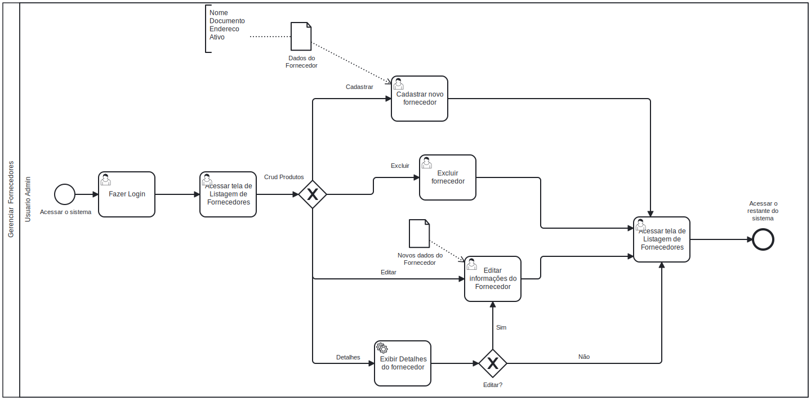

# 3.3.2 Processo 2 – Gerenciar Fornecedores

Este processo descreve as etapas para gerenciar fornecedores dentro do sistema, abrangendo a adição de novos fornecedores, atualizações de informações e exclusão de fornecedores inativos.

---

## Oportunidades de Melhoria

1. Permitir o cadastro de usuários com permissão de **Fornecedor**, possibilitando que eles mesmos possam cadastrar os produtos associados.  
2. Adicionar filtros de busca para facilitar a localização de fornecedores.  
3. Integrar notificações automáticas para fornecedores em status inativo com opções para reativação.  
4. Disponibilizar relatórios dinâmicos sobre fornecedores cadastrados e seus produtos.  

---

## Modelo do Processo 2 (Gerenciamento de Fornecedores)

### Detalhamento das Atividades

1. **Acessar sistema**  
   - O usuário administrativo inicia o processo ao acessar o sistema de gerenciamento.  

2. **Fazer Login**  
   - O usuário administrativo insere suas credenciais para acessar a área de gerenciamento de fornecedores.  

3. **Exibir lista de fornecedores**  
   - Após o login bem-sucedido, o sistema apresenta uma listagem dos fornecedores com opções de gerenciamento.  

4. **Adicionar/Editar/Remover fornecedor**  
   - O usuário pode realizar as seguintes operações:  
     - Adicionar novos fornecedores.  
     - Exibir os detalhes dos fornecedores existentes.  
     - Editar informações como nome, documento e endereço.  
     - Remover fornecedores marcados como inativos.  

5. **Retornar para a tela de listagem**  
   - Após qualquer operação CRUD, o sistema retorna para a tela de listagem de fornecedores.  

6. **Fim**  
   - O processo é concluído ao encerrar as operações ou visualizar o resumo de ações realizadas.  

---

## Tipos de Dados Utilizados

| Campo                  | Tipo             | Restrições                             | Valor Padrão                |  
|------------------------|------------------|----------------------------------------|-----------------------------|  
| Nome do fornecedor     | Caixa de texto   | Mínimo de 5 caracteres                 | -                           |  
| Documento              | Caixa de texto   | Obrigatório, formato válido (CPF/CNPJ) | -                           |  
| Endereço               | Área de texto    | Até 300 caracteres                     | -                           |  
| Status (Ativo/Inativo) | Seleção única    | Obrigatório                            | Ativo                       |  
| Produtos cadastrados   | Lista            | Associado ao fornecedor, opcional      | Vazio                       |  

---

## Comandos Disponíveis

| Comando    | Ação                                | Tipo       |  
|------------|-------------------------------------|------------|  
| Adicionar  | Cadastrar novo fornecedor           | Default    |  
| Editar     | Alterar dados de um fornecedor      | Seleção    |  
| Excluir    | Remover fornecedor                  | Seleção    |  
| Atualizar  | Atualizar informações do fornecedor | Seleção    |  
| Exibir     | Visualizar detalhes do fornecedor   | Seleção    |  
| Associar   | Vincular produtos ao fornecedor     | Seleção    |  

---

## Fluxo CRUD do Gerenciamento de Fornecedores

1. **Adicionar Fornecedor**  
   - O usuário preenche os campos (nome, documento, endereço e status) e confirma. O sistema valida os dados e os armazena no banco.  

2. **Editar Fornecedor**  
   - O usuário seleciona um fornecedor, edita os campos necessários e confirma. O sistema valida e atualiza as informações.  

3. **Remover Fornecedor**  
   - O usuário escolhe um fornecedor na lista para exclusão. O sistema verifica se ele está marcado como inativo antes de concluir a operação.  

4. **Exibir Fornecedor**  
   - O usuário pode visualizar os detalhes de um fornecedor clicando na listagem.  

5. **Associar Produtos**  
   - O usuário pode associar ou atualizar os produtos vinculados a um fornecedor selecionado.  

6. **Atualizar Dados**  
   - O sistema permite ao usuário revisar e atualizar informações conforme a necessidade.  

---

## Melhorias Futuras

1. Implementar a funcionalidade de exportação de dados de fornecedores em formatos como Excel e PDF.  
2. Automatizar a verificação de documentos (CPF/CNPJ) para garantir validade e autenticidade.  
3. Desenvolver um módulo para gerenciar contratos e prazos de fornecimento.  
4. Criar alertas automáticos para fornecedores inativos há mais de 6 meses.  
