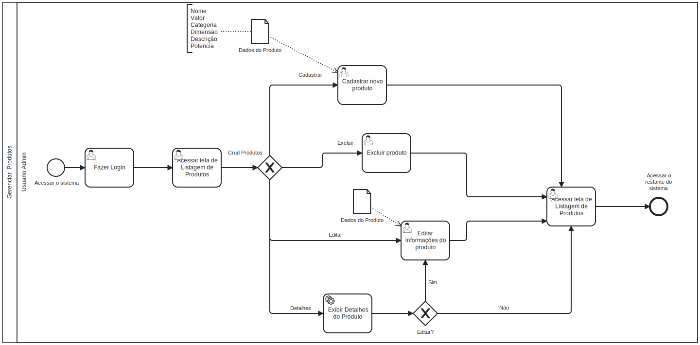

# 3.3.2 Processo 3 – Gerenciar Produtos

Este processo descreve as etapas para o gerenciamento de produtos dentro do sistema, incluindo a adição, edição, remoção e exibição de detalhes de produtos.

---

## Oportunidades de Melhoria

1. Facilitar a busca por produtos através de filtros e categorias mais específicas.  
2. Integrar com sistemas de fornecedores para otimizar o reabastecimento de produtos.  
3. Implementar notificações automáticas para alertar sobre produtos com estoque baixo.  
4. Disponibilizar relatórios detalhados sobre o desempenho dos produtos no sistema.  
5. Permitir upload em massa para a inclusão de múltiplos produtos simultaneamente.  

---

## Detalhamento das Atividades

1. **Acessar Sistema**  
   - O usuário administrativo inicia o processo ao acessar o sistema de gerenciamento.  

2. **Fazer Login**  
   - O usuário insere suas credenciais para acessar a área de gerenciamento de produtos.  

3. **Exibir Lista de Produtos**  
   - Após o login bem-sucedido, o sistema exibe a listagem dos produtos e as opções disponíveis de gerenciamento.  

4. **Adicionar/Editar/Remover Produto**  
   - O usuário pode realizar as seguintes operações:  
     - **Adicionar** novos produtos preenchendo os campos necessários.  
     - **Editar** informações de produtos existentes, como preço, descrição, e atributos técnicos.  
     - **Excluir** produtos obsoletos ou descontinuados.  
     - **Exibir Detalhes** para visualizar informações específicas de um produto.  

5. **Retornar para a Tela de Listagem**  
   - Após realizar uma operação (CRUD), o sistema retorna para a tela de listagem atualizada.  

6. **Fim**  
   - O processo é concluído após a execução de todas as alterações necessárias.  

---

## Tipos de Dados Utilizados

| **Campo**                  | **Tipo**         | **Restrições**                        | **Valor Padrão**          |
|----------------------------|------------------|---------------------------------------|---------------------------|
| Nome                       | Caixa de texto   | Mínimo de 5 caracteres                | -                         |
| Tipo do Produto            | Seleção única    | Tipos pré-definidos                   | -                         |
| Descrição                  | Área de texto    | Até 500 caracteres                    | -                         |
| Valor                      | Número           | Obrigatório, maior que 0              | 0.00                      |
| Data de Cadastro           | Data e Hora      | Formato: dd-mm-aaaa hh:mm:ss          | Data e hora do cadastro   |
| Status (Ativo/Inativo)     | Seleção única    | Obrigatório                           | Ativo                     |
| Dimensão (m²)              | Número           | Opcional                              | -                         |
| Eficiência (%)             | Número           | Opcional, valores entre 0 e 100       | -                         |
| Potência (W)               | Número           | Opcional                              | -                         |
| Corrente (A)               | Número           | Opcional                              | -                         |
| Tensão (V)                 | Número           | Opcional                              | -                         |
| Saída                      | Número           | Opcional, mínimo de 1 saída           | 1                         |
| Imagem do Produto          | Upload           | Apenas arquivos JPG/PNG               | -                         |

---

## Fluxo de Ações

| **Ação**                   | **Descrição**                                  | **Destino**              |
|----------------------------|------------------------------------------------|--------------------------|
| Adicionar Produto          | Inserir informações de um novo produto         | Tela de confirmação      |
| Editar Produto             | Atualizar informações de um produto existente  | Tela de confirmação      |
| Excluir Produto            | Remover um produto obsoleto                    | Tela de confirmação      |
| Exibir Detalhes do Produto | Visualizar informações completas de um produto | Tela de detalhes         |
| Atualizar Estoque          | Alterar quantidade disponível de um produto    | Tela de confirmação      |

---

## Melhorias Futuras

1. Adicionar filtros dinâmicos para busca avançada por produtos.  
2. Integrar com APIs de fornecedores para sincronização automática de estoque e preços.  
3. Implementar dashboard analítico para monitoramento de vendas e desempenho de produtos.  
4. Adicionar funcionalidade para revisão de produtos por clientes e avaliação direta na plataforma.  
5. Oferecer sugestões automáticas de preços com base em inteligência de mercado e concorrência.  
6. Garantir controle de acesso detalhado para diferentes níveis de usuários no sistema.  
