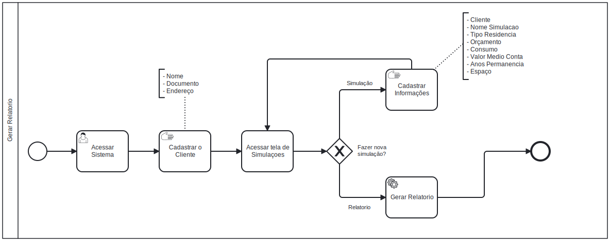

# 3.3.3 Processo 04 – Gerar Relatório do Projeto  

O processo **Dimensionar Projeto** compreende as etapas necessárias para criar um projeto personalizado de geração fotovoltaica e acessar dados de fornecedores locais. Ele é projetado para ser intuitivo, permitindo que o usuário finalize as ações rapidamente.  

---

## Oportunidades de Melhoria  

1. Automatizar a geração de relatórios em formato PDF, eliminando a necessidade de usar a funcionalidade de impressão do navegador.  
2. Implementar integração com APIs de fornecedores para atualização dinâmica de preços e estoques.  
3. Adicionar validações em tempo real nos campos de entrada de dados para evitar erros no preenchimento.  
4. Disponibilizar simulações visuais do projeto, mostrando a disposição dos módulos solares no telhado.  
5. Oferecer integração com mapas para verificar fornecedores próximos diretamente no sistema.  

---

## Detalhamento das Atividades  

1. **Acessar Sistema**  
   - O usuário administrativo inicia o processo ao acessar o sistema de gerenciamento.  

2. **Fazer Login**  
   - O usuário insere suas credenciais para acessar a área de dimensionamento de projetos e fornecedores.  

3. **Exibir Lista de Fornecedores**  
   - O sistema apresenta uma listagem de fornecedores disponíveis na região de interesse do cliente.  

4. **Realizar Dimensionamento**  
   - O agente utiliza as informações fornecidas pelo cliente para preencher os seguintes campos:  
     - Nome do projeto  
     - CEP  
     - Número de águas do telhado  
     - Metragem em metros quadrados de cada água  
     - Dados de consumo mensal (kWh, média dos últimos 12 meses)  
     - Valores pagos (R$, média dos últimos 12 meses)  
     - Especificações dos módulos solares (área e potência)  
     - Tipo de telhado  
     - Intenção de upgrade na geração  
     - Percentual de crescimento da usina (30%, 50%, 100%)  

   ### Relatório Gerado  
   O sistema gera um relatório com as seguintes informações:  
   - Média anual de consumo (kWh) e custo (R$).  
   - Quantidade de módulos solares necessários e potência individual.  
   - Potência total gerada pelo sistema.  
   - Modelo e quantidade de inversores adequados.  
   - Estrutura recomendada para instalação.  
   - Custo médio de implantação e tempo de payback estimado.  
   - Contatos de fornecedores locais.  
   - Instruções básicas de instalação:  
     - Ângulo de inclinação dos módulos baseado na localização.  
     - Orientação dos módulos em relação ao equador.  

5. **Enviar Resultados**  
   - O agente entra em contato com o cliente e envia o relatório detalhado, incluindo as informações sobre fornecedores e estimativas do projeto.  

6. **Fim**  
   - O processo é concluído após o envio dos resultados ou a finalização do atendimento.  

---

## Tipos de Dados Utilizados  

| **Campo**                        | **Tipo**         | **Restrições**                                   |  
|----------------------------------|------------------|-------------------------------------------------|  
| Nome do projeto                  | Texto            | Obrigatório                                     |  
| CEP                              | Texto            | Formato: 00000-000, obrigatório                 |  
| Número de águas do telhado       | Número           | Obrigatório                                     |  
| Metragem (m²)                    | Número           | Obrigatório                                     |  
| Dados de consumo mensal (kWh)    | Número           | Obrigatório                                     |  
| Valores pagos (R$)               | Número           | Obrigatório                                     |  
| Especificações dos módulos       | Texto/Número     | Obrigatório                                     |  
| Tipo de telhado                  | Seleção única    | Opcional                                        |  
| Intenção de upgrade (%)          | Seleção única    | Opcional (30%, 50%, 100%)                       |  

---

## Processos Internos  

| **Comando**         | **Descrição**                                   | **Tipo**         |  
|---------------------|------------------------------------------------|------------------|  
| Gerar relatório     | Gera relatório detalhado com dados do projeto  | Automático       |  
| Exportar resultados | Permite salvar os resultados em PDF            | Manual (usuário) |  
| Enviar e-mail       | Envia resultados ao cliente via e-mail         | Manual           |  

---

## Melhorias Futuras  

1. Automatizar o envio de relatórios diretamente em formato PDF ao cliente.  
2. Criar um módulo de visualização 3D para disposição dos módulos solares no telhado do cliente.  
3. Incorporar análises avançadas de consumo para oferecer recomendações mais precisas.  
4. Estender o suporte a diferentes tipos de projetos, como geração híbrida (solar e eólica).  
5. Disponibilizar uma funcionalidade de agendamento para instalação do sistema diretamente no painel do cliente.  
